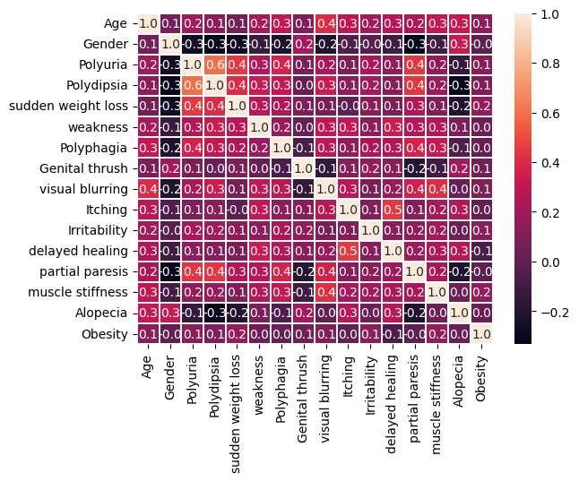
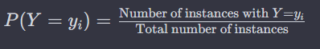
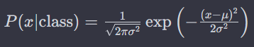
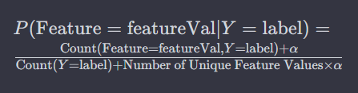
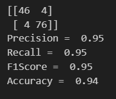
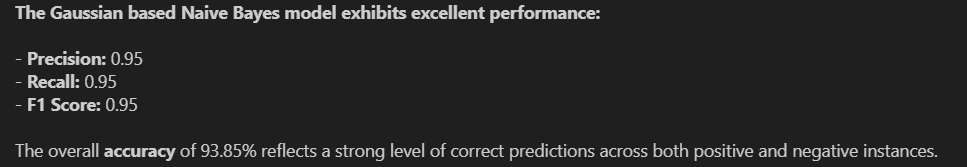
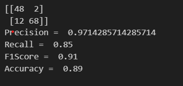
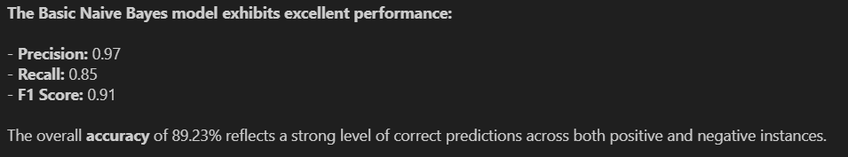

# Naive Bayes from Scratch

## Introduction

Naive Bayes is a popular and efficient classification algorithm that falls under the umbrella of probabilistic models. Its simplicity, effectiveness, and scalability make it a widely used choice for various applications, including text classification, spam filtering, and medical diagnosis. The algorithm is based on Bayes' theorem, which provides a principled way to calculate the probability of a hypothesis based on observed evidence. Naive Bayes assumes that features are conditionally independent given the class label, simplifying the computation and making it computationally efficient.

## Aim
This project is set out with the following objectives:

* **Understanding Naive Bayes Fundamentals:**
Embarking on a comprehensive exploration of the Naive Bayes algorithm, the project aims to unravel the core principles that underlie this probabilistic classification method.

* **Leveraging Numpy and Pandas for Implementation:**
The primary coding implementation of the project relies solely on the capabilities of Numpy and Pandas. This strategic choice emphasizes a minimalist approach, allowing for a clear understanding of the algorithm's implementation without the assistance of external libraries.

* **Hands-On Experience in Building a Naive Bayes Classifier:**
One of the key goals is to provide a hands-on experience for participants. By actively engaging in the process of constructing a Naive Bayes classifier, individuals can gain practical insights into the workings of the algorithm.

* **Independence from External Libraries:**
A notable aspect of this project is the deliberate avoidance of external libraries, emphasizing self-sufficiency in the implementation. This decision encourages a deeper connection with the code and a more profound understanding of the Naive Bayes algorithm.

* **Delving into Algorithmic Intricacies:**
The project aims to delve into the intricacies of the Naive Bayes algorithm, providing participants with a nuanced comprehension of its inner workings. This includes exploring how the algorithm handles conditional independence assumptions and probability calculations.

* **Real-World Implementation Scenarios:**
Beyond theoretical understanding, the project aspires to bridge the gap between concept and application. Participants will explore the practical aspects of implementing Naive Bayes in real-world scenarios, enhancing their ability to apply the algorithm to diverse problem domains.

In essence, this project serves as a deep learning experience, helping with a thorough understanding of Naive Bayes through coding and aiming implement and apply this classification algorithm independently.

## The Project follows the following steps
### Step 1 - [Importing the Libraries](./NaiveBayesFromScratch.ipynb#Importing-Libraries) : numpy, pandas, matplotlib.pyplot, seaborn, sklearn (for basics)
### Step 2 - [Loading the Dataset](./NaiveBayesFromScratch.ipynb#Dataset): The [dataset](https://www.kaggle.com/datasets/tanshihjen/early-stage-diabetes-risk-prediction) provides essential information about individuals displaying early signs of diabetes or facing a potential risk of developing the condition. The variables in the dataset offer valuable insights into potential indicators that suggest the onset of diabetes. It covers a broad spectrum of information, including demographic details and specific symptoms associated with diabetes. Essentially, this dataset serves as a comprehensive resource for understanding and identifying factors related to the early stages and risk factors of diabetes.

#### Data Card
Attributes Description:

* Age (1-20 to 65): Age range of the individuals.
* Sex (1. Male, 2. Female): Gender information.
* Polyuria (1. Yes, 2. No): Presence of excessive urination.
* Polydipsia (1. Yes, 2. No): Excessive thirst.
* Sudden Weight Loss (1. Yes, 2. No): Abrupt weight loss.
* Weakness (1. Yes, 2. No): Generalized weakness.
* Polyphagia (1. Yes, 2. No): Excessive hunger.
* Genital Thrush (1. Yes, 2. No): Presence of genital thrush.
* Visual Blurring (1. Yes, 2. No): Blurring of vision.
* Itching (1. Yes, 2. No): Presence of itching.
* Irritability (1. Yes, 2. No): Display of irritability.
* Delayed Healing (1. Yes, 2. No): Delayed wound healing.
* Partial Paresis (1. Yes, 2. No): Partial loss of voluntary movement.
* Muscle Stiffness (1. Yes, 2. No): Presence of muscle stiffness.
* Alopecia (1. Yes, 2. No): Hair loss.
* Obesity (1. Yes, 2. No): Presence of obesity.
* Target Variable: Class (1. Positive, 2. Negative): Diabetes classification.

| Age | Gender | Polyuria | Polydipsia | Sudden Weight Loss | Weakness | Polyphagia | Genital Thrush | Visual Blurring | Itching | Irritability | Delayed Healing | Partial Paresis | Muscle Stiffness | Alopecia | Obesity | Class     |
|-----|--------|----------|------------|--------------------|----------|------------|-----------------|------------------|---------|--------------|-----------------|------------------|-------------------|----------|---------|-----------|
| 40  | Male   | No       | Yes        | No                 | Yes      | No         | No              | No               | Yes     | No           | Yes             | No               | Yes               | Yes      | Yes     | Positive  |
| 58  | Male   | No       | No         | No                 | Yes      | No         | No              | No               | Yes     | No           | No              | No               | Yes               | No       | Yes     | Positive  |
| 41  | Male   | Yes      | No         | No                 | Yes      | Yes        | No              | No               | Yes     | No           | Yes             | No               | Yes               | Yes      | No      | Positive  |
| 45  | Male   | No       | No         | Yes                | Yes      | Yes        | Yes             | No               | Yes     | No           | Yes             | No               | No                | No       | No      | Positive  |
| 60  | Male   | Yes      | Yes        | Yes                | Yes      | Yes        | No              | Yes              | Yes     | Yes          | Yes             | Yes              | Yes               | Yes      | Yes     | Positive  |

Dataset License: [License](https://creativecommons.org/licenses/by/4.0/)

### Step 3 - [EDA]((./NaiveBayesFromScratch.ipynb#EDA)) (Exploratory Data Analysis): Here we find out more about the nature of the variable, their distribution and Correlation. Also, a small part of data wrangling is also included to convert the categorical variable to numerical variables. 

* **Heat Map**

#### **After data wrangling the dataset looks like this:**

| Age | Gender | Polyuria | Polydipsia | Sudden Weight Loss | Weakness | Polyphagia | Genital Thrush | Visual Blurring | Itching | Irritability | Delayed Healing | Partial Paresis | Muscle Stiffness | Alopecia | Obesity | Class |
|-----|--------|----------|------------|---------------------|----------|------------|-----------------|------------------|---------|--------------|-----------------|------------------|-------------------|----------|---------|-------|
| 40  | 1      | 0        | 1          | 0                   | 1        | 0          | 0               | 0                | 1       | 0            | 1               | 0                | 1                 | 1        | 1       | 1     |
| 58  | 1      | 0        | 0          | 0                   | 1        | 0          | 0               | 0                | 1       | 0            | 0               | 0                | 1                 | 0        | 1       | 1     |
| 41  | 1      | 1        | 0          | 0                   | 1        | 1          | 0               | 0                | 1       | 0            | 1               | 0                | 1                 | 1        | 0       | 1     |
| 45  | 1      | 0        | 0          | 1                   | 1        | 1          | 1               | 1                | 0       | 1            | 0               | 1                | 0                 | 0        | 0       | 1     |
| 60  | 1      | 1        | 1          | 1                   | 1        | 1          | 0               | 1                | 1       | 1            | 1               | 1                | 1                 | 1        | 1       | 1     |

### Step 4 - [Calculating Prior](./NaiveBayesFromScratch.ipynb#Calculating-Prior): Based on the genral fromula of Prior, we creat a function to calculate the prior i.e., P(Y=yi)

### Step 5 - [Calculate Bayesian Inference](./NaiveBayesFromScratch.ipynb#Calculate-Bayesian-Inference): Here we calulate the likelihhod using the Gaussian Distribution and the Laplacian smoothing technique used in Naive Bayes classification.
-------------------------------------------------------------------------------------------------------------------------
* Gaussian Distribution Formula used:

\
-------------------------------------------------------------------------------------------------------------------------
* Laplacian smoothing technique Formula used:

-------------------------------------------------------------------------------------------------------------------------

#### **Why Laplcae Smoothing**: Laplace smoothing is a common technique to handle zero probabilities, especially in situations where the data is sparse or when dealing with categorical variables.

### Step 6 - Finding the likelihood of the feature variables given the target variable.

### Step 7 - [Testing the Model](./NaiveBayesFromScratch.ipynb#Testing-the-Model): We create a user choice where the user can choose from the two methods either the Gaussian or the Basic Naive Bayes using the Laplace Smoothing. Based on this the results are presented.

### Step 8 -[Results](./NaiveBayesFromScratch.ipynb#Results): Here, using the sklearn library we get the confusion matrix and we try to create our own calculation system for Precision, Recall, F1-Score, Accuracy for each of the methods.

-------------------------------------------------------------------------------------------------------------------------
#### For Gaussian:

-------------------------------------------------------------------------------------------------------------------------
#### For Basic Naive Bayes with Laplace Smoothing:

-------------------------------------------------------------------------------------------------------------------------
## Note:

### The inspiration of code is taken from: https://github.com/Suji04/ML_from_Scratch/ and the main aim lie in learning the algorith and not copying of the code. This project aims at understanding the concept of Naive Bayes using Python